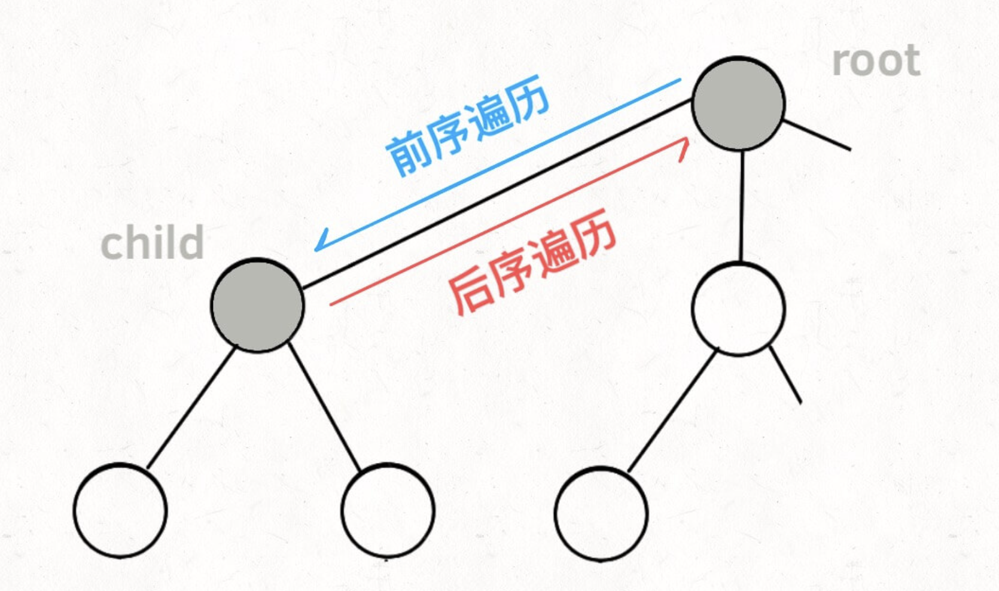

### 数据结构

- 数组
  - 快数组
  - 慢数组
  - js的数组是hash散列表map
- 链表
- 栈
- 队列
- 散列表

### 树

- 二叉树
  - 深度遍历
  - 广度遍历
  - 前序中序后序
  - 应用场景
- 二叉堆？？
  - 使用场景：
- 遍历
  - 深度优先
  - 广度优先

### 排序

- 冒泡
- 快速
- 插入
- 堆
- 选择
- 计数
- 桶排序

### 回溯([参考](https://github.com/labuladong/fucking-algorithm/blob/master/%E7%AE%97%E6%B3%95%E6%80%9D%E7%BB%B4%E7%B3%BB%E5%88%97/%E5%9B%9E%E6%BA%AF%E7%AE%97%E6%B3%95%E8%AF%A6%E8%A7%A3%E4%BF%AE%E8%AE%A2%E7%89%88.md))

- 基本思路：一个类似枚举的搜索尝试过程，主要是在搜索尝试过程中寻找问题的解，当发现已不满足求解条件时，就“回溯”返回，简单来说就是从一条路往前走，能进则进，不能进则退回来，换一条路再试

- 关键点：

  - 路径：也就是已经做出的选择。
  - 选择列表：也就是你当前可以做的选择。
  - 结束条件：也就是到达决策树底层，无法再做选择的条件。

- 用法

  - [1,2,3]全排列问题

    

  

  ```js
  result = []
  define backtrack(路径, 选择列表):
      if 满足结束条件:
          result.add(路径)
          return
      
      for 选择 of 选择列表:
          // 做选择
          将该选择从选择列表移除
          路径.add(选择)
          backtrack(路径, 选择列表) // 递归
          // 撤销选择
  				路径.remove(选择)
          将该选择再加入选择列表
  ```

- **这里定义的 `backtrack` 函数其实就像一个指针，在这棵树上游走，同时要正确维护每个节点的属性，每当走到树的底层，其「路径」就是一个全排列**。

- 如何遍历一棵树？多叉树遍历

  ```js
  traverse(root) {  // TreeNode
      for (child of root.children)
          // 前序遍历需要的操作
          traverse(child);
          // 后序遍历需要的操作
  }
  ```

  

  

- 在这里的就简化为**在递归之前做出选择，在递归之后撤销刚才的选择**，就能正确得到每个节点的选择列表和路径。

- 例子

  - 全排列

    ```js
    const permute = function (nums) {
      const result = [];
      // 回溯函数
      const backTrack = (path, set) => {
        // 设置终止条件
        if (path.length === nums.length) {
          // 加入结果
          result.push([...path])
          // 退出递归
          return
        }
        for (let i = 0; i < nums.length; i++) {
          if (!set.has(i)) {
            // 1.选择路径
            path.push(nums[i])
            set.add(i)
            // 2.递归
            backTrack(path, set)
            // 3.回溯：撤回1的操作
            path.pop()
            set.delete(i)
          }
        }
      }
      backTrack([], new Set())
      return result
    }
    ```

    

  - N皇后

    ```js
    // 判断该位是否是有效位
    const isValid = (row, col, n, board) => {
        for (let i = 0; i < row; i++) {
            for (let j = 0; j < n; j++) {
                if (board[i][j] === 'Q' && (
                    j === col || i - j === row - col || i + j === row + col
                )) {
                    return false
                }
            }
    
        }
        return true
    }
    var solveNQueens = function(n) {
        const board = [];
        for (let i = 0; i < n; i++) {
            board[i] = (new Array(n)).fill('.')
        }
        const res = []
        const backTrack = (row) => {
            // 终止条件
            if (row === n) {
                const resSub = board.slice()
                res.push(resSub.map(v => v.join('')))
                console.log('res', res)
                return 
            }
            // 路径：board中小于row的行已成功放置Q
            // 选择列表：row所在列都是可以选择放置q的地方
            for (let col = 0; col < n; col++) {
                if (!isValid(row, col, n, board)) {
                    continue
                }
                // 选择
                board[row][col] = 'Q'
                // 递归
                backTrack(row+1)
                // 回溯
                board[row][col] = '.'
            }
        }
        backTrack(0)
        return res
    };
    ```

    

    - 划分为k个相等的子集

    ```js
    var canPartitionKSubsets = function(nums, k) {
        const len = nums.length
        if (k > len) {
            return false
        }
        const sum = nums.reduce((a,b) => a + b, 0)
        
        if (sum % k !== 0) {
            return false
        }
        if (k === 1) {
            return true
        }
    
        const subList = Array(k).fill(0)
        const initSum = sum / k
        
        // subList: 可选择的路径
        // index: 当前选择的
        const backTrack = (index) => {
          // 终止条件
            if (index === len) return true
            for (let i = 0; i < k; i++) {
                if (subList[i] + nums[index] <= initSum) {
                  // 选择
                    subList[i] += nums[index]
                    if (backTrack(index + 1)) return  true
                  // 回溯
                    subList[i] -= nums[index]
                } 
                if (subList[i] === 0 || subList[i] + nums[index] === initSum)  break
            }
            return false
        }
        return backTrack(0)
    };
    ```

    

### 贪心

- 基本思路： 将求解过程分成**若干个步骤**，但每个步骤都应用贪心原则，选取当前状态下**最好/最优的选择**（局部最有利的选择），并以此希望最后堆叠出的结果也是最好/最优的解

- 思路：

  - 从某个初始解出发
  - 迭代，当可以向目标前进一步时，得到局部最优解，缩小问题规模
  - 收集所有的解

- 例子

  - 整数转罗马数字

    ```js
    var intToRoman = function(num) {
        let res = ''
        let m = Math.floor(num / 1000)
        if (m) {
            res +=Array(m).fill('M').join('')
        }
        let remain = num - m*1000
        let cm = Math.floor(remain / 900)
        if (cm) {
            res += 'CM'
            remain -= cm*900
        }
        let d = Math.floor(remain / 500)
        if (d) {
            res += 'D'
            remain -= d*500
        }
        let cd = Math.floor(remain / 400)
        if (cd) {
            res += 'CD'
            remain -= cd*400
        }
        let c = Math.floor(remain/ 100)
        if (c) {
            res +=Array(c).fill('C').join('')
            remain -= c*100
        }
        let xc = Math.floor(remain / 90)
        if (xc) {
            res += 'XC'
            remain -= xc*90
        }
        let l = Math.floor(remain/ 50)
        if (l) {
            res += 'L'
            remain -= l*50
        }
        let xl = Math.floor(remain/ 40)
        if (xl) {
            res += 'XL'
            remain -= xl*40
        }
        let x = Math.floor(remain/ 10)
        if (x) {
            res +=Array(x).fill('X').join('')
            remain -= x*10
        }
        let ix = Math.floor(remain/ 9)
        if (ix) {
            res += 'IX'
            remain -= ix*9
        }
        let v = Math.floor(remain/ 5)
        if (v) {
            res += 'V'
            remain -= v*5
        }
        let iv = Math.floor(remain/ 4)
        if (iv) {
            res += 'IV'
            remain -= iv*4
        }
        if (remain) {
            res +=Array(remain).fill('I').join('')
        }
        return res
    };
    
    var intToRoman = function(num) {
        let res = ''
        const values = [1000, 900, 500, 400, 100, 90, 50, 40, 10, 9, 5, 4, 1]
        const romanValues = ['M', 'CM', "D","CD","C","XC","L","XL","X","IX","V","IV","I"]
        for (let i = 0; i < values.length; i++) {
            while (num >= values[i]) {
                num -= values[i]
                res += `${romanValues[i]}`
            }
        }
        return res
    };
    ```

    