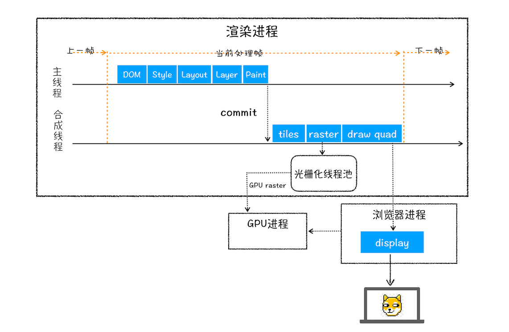

#### **浏览器从读取网址**到渲染页面流程？

- 浏览器解析url：得到协议、网址、端口号(http协议默认端口号是80)、资源路径(path),组装请求，准备发起请求

- 查看缓存，没有命中缓存则继续

  强缓存和协商缓存(一般针对GET请求):

  - 通过response header中的字段判断是否开启强缓存，控制开启强缓存的字段为Expires(优先级最低，在这个时间戳之前都是有效缓存)、pragma(http1.0的字段，向后兼容,no-cache优先级>Cache-control)、Cache-Control(max-age:秒)
  - 是强缓存，直接使用本地缓存的资源(一般缓存在disk cache和memory cache，命中则被浏览器拦截此次请求并返回缓存的资源并标识200 form disk/memory cache)

  - 不走强缓存或缓存过期，则开始协商缓存，last-modified和if-modified-since,和Etag和if-None-Matched.浏览器第一次请求会将资源的最后修改时间放在lastmodified中，第二次请求时就会自动把这个字段放在if-modified-since,服务端会比较资源的最后一次修改时间和if-modifed-since的值，如果相等，则命中缓存，返回304读取缓存,否则返回200，更新资源和缓存标识；Etag同理，只是存放的是资源标识符的hash值，不过这存在强校验和弱校验，Etag优先级高于last-modified
  - application/cache（离线缓存，已被废弃，manifest文件保存缓存的文件）
  - service worker

- DNS域名解析：查看浏览器是否有此DNS记录，再查找操作系统中host中是否有域名 IP的对应记录，再找路由器中的缓存，再从ISP中查找缓存，最后从域名服务器查找(客户端会向本地DNS服务器发送一个域名的DNS查询报文， 本地DNS服务器与根 com xxxDNS服务器交流)，迭代向上查找，先找根域名服务器(一般本地DNS服务器有comDNS服务器，所以这一步不是必须) =>再找上一级 .com .cn .org =>再找上一级，最后返回具体的IP地址给本地DNS服务器，本地DNS服务器将含有域名的IP地址响应报文发送给客户端

- 建立TCP通信,三次握手(客户端SYN=1,seq=x,SYN SEND, 服务端发送确认包ACK应答，SYN=1，ACK=1，seq=y, ACKnum=x+1,SYN RCVD,客户端收到应答后，标志位ACK=1,ACKnum=y+1,ESTABLISHED)，TCP前两次通信不传输信息

- 若是https，则需要进行TLS四次握手加密信息

- 链接建立后等待服务器应答，等到响应后根据响应头的缓存标识更新缓存

- 若没有设置connection keepalive则会进行四次挥手断开这次tcp链接，四次挥手，由一端(比如客户端)开始发起标志位FIN = 1，seq=x的包，表示没有数据要发送了，但还是可以接受，进入FIN_Wait_1状态，另一端(服务端)接受到这个包，返回ACK=1，ACKnum=x+1表示接受到这个请求但还没有准备好关闭服务，发送后服务端进入Close-waite，客户端接受到这个包会进入FIN-waited-2状态；服务端准备好关闭链接时，会发送FIN=1，seq=y给客户端告知，进入LAST-ACK状态，客户端接受到返回ACK=1，ACKnum=y+1确认包给服务端，进入TIME-wait状态，等待可能出现需要重传的ACK包，服务端接受到这个包后进入CLosed状态，客户端等2个最大段生命周期时间后没有受到ACK包也进入closed

- 构建渲染(样式、布局、绘制，在某些情况下还包括合成)：

  - 自上而下解析HTML文档构建DOM树，遇到内联style或link的样式交由css渲染器构建css规则树，其中加载link的样式是异步的，同时构建DOM与CSSOM是并行进行的，如果遇到script标签会中断DOM树的构建，而解析js又会依赖css解析
  - 构建渲染树：从DOM中找出所有的可见节点，再找到css规则书中对应的节点合并renderTree
  - 计算元素大小和位置layout，painting
    - 回流：若一个元素的位置和大小发生变化则与其有关的部分就会失效进行重新构造渲染树
    - 重绘：当元素字体颜色或背景色发生变化时，渲染树不会重新构建只需要重新绘制
    - 为避免更小粒度的变化造成多次回流或重绘(比如要实现一些复杂的动画效果，每一帧变化都会造成回流重绘)，影响页面的渲染效率，采用分层然后再合成,<video>和<canvas>，任何CSS属性为opacity、3D转换will-change

- 完成页面呈现的整个过程

[参考](https://developer.mozilla.org/zh-CN/docs/Web/Performance/How_browsers_work)

#### 浏览器解释js代码的原理、浏览器线程进程

- js是解释性语言，js引擎(解释器)：V8、spiderMonkey、chakra、jsCore，所有引擎都包含一个CallStack和MemoryHeap

- 打开一个浏览器开启的进程和线程(以chrome为列)：

  - **浏览器进程**：浏览器最核心的进程，负责管理各个标签页的创建和销毁、页面显示和功能（前进，后退，收藏等)、界面显示、用户交互、子进程管理，同时提供存储等功能

  - **插件进程**：负责每个第三方插件的使用，每个第三方插件使用时候都会创建一个对应的进程、这可以避免第三方插件crash影响整个浏览器、也方便使用沙盒模型隔离插件进程，提高浏览器稳定性。

  - **GPU进程**：负责3D绘制和硬件加速

  - **网络进程**：负责页面的网络资源加载，之前是作为一个模块运行在浏览器进程里面的，直至最近才独立出来，成为一个单独的进程

  - **渲染进程**：核心任务是将 HTML、CSS 和 JavaScript 转换为用户可以与之交互的网页，排版引擎 Blink 和 JavaScript 引擎 V8 都是运行在该进程中，默认情况下，Chrome 会为每个 Tab 标签创建一个渲染进程。出于安全考虑，渲染进程都是运行在沙箱模式下

    - 浏览器会为每个窗口分配一个渲染进程、也就是我们常说的**浏览器内核**，这可以避免单个 page crash 影响整个浏览器。

    - 浏览器内核(**webkit**)是多线程，在内核控制下各线程相互配合以保持同步，一个内核一般有以下几个线程

    - **GUI 渲染线程**：负责渲染浏览器界面 `HTML` 元素,当界面需要重绘(`Repaint`)或由于某种操作引发回流(reflow)时,该线程就会执行。

    - **定时触发器线程**：浏览器定时计数器并不是由 `JavaScript` 引擎计数的, 因为 `JavaScript` 引擎是单线程的, 如果处于阻塞线程状态就会影响记计时的准确, 因此通过单独线程来计时并触发定时是更为合理的方案。

    - **事件触发线程**：当一个事件被触发时该线程会把事件添加到待处理队列的队尾，等待JS引擎的处理。这些事件可以是当前执行的代码块如定时任务、也可来自浏览器内核的其他线程如鼠标点击、`AJAX` 异步请求等，但由于JS的单线程关系所有这些事件都得排队等待JS引擎处理。

    - **异步http请求线程**：`XMLHttpRequest` 在连接后是通过浏览器新开一个线程请求， 将检测到状态变更时，如果设置有回调函数，异步线程就产生状态变更事件放到 `JavaScript` 引擎的处理队列中等待处理。

    - **`JavaScript` 引擎线程**：解释和执行 JavaScript 代码
    
      **`GUI` 渲染线程与 `JavaScript` 引擎为互斥的关系，当 `JavaScript` 引擎执行时 `GUI` 线程会被挂起， `GUI` 更新会被保存在一个队列中等到引擎线程空闲时立即被执行。**

  **输入URL各个进程工作流程**：

  整个过程可以大致描述为如下：

  - 浏览器进程接收到用户输入的 URL 请求，浏览器进程便将该 URL 转发给网络进程。

  - 在网络进程中发起真正的 URL 请求。

    - 首先，网络进程会查找本地缓存是否缓存了该资源。如果有缓存资源，那么直接返回资源给浏览器进程；
    - 如果在缓存中没有查找到资源，那么直接进入网络请求流程

    -  DNS解析：有DNS缓存，直接获取域名的服务器 IP 地址，否则请求DNS服务器来获得
    - 请求协议是 HTTPS，那么还需要建立 TLS 连接。（如果是http这步没有）

    ​     TLS:在连接中要完成秘钥交换，浏览器与服务器完成密钥交换，以确保安全性

    - 利用 IP 地址和服务器建立 TCP 连接
    - 连接建立之后，浏览器端会构、请求头等信息，并把和该域名相关的 Cookie 等数据附加到请求头中，然后向服务器发送构建的请求信息。

    - 服务器接收到请求信息后，会根据请求信息生成响应数据
    - 收到服务器返回的响应头后，网络进程开始解析响应头，如果发现返回的状态码是 301 或者 302，那么说明服务器需要浏览器重定向到其他 URL。这时网络进程会从响应头的 Location 字段里面读取重定向的地址，然后再发起新的 HTTP 或者 HTTPS 请求，从头开始。

    - 响应数据类型处理：有时候是一个下载类型，有时候是正常的 HTML 页面，怎么处理？

    ​     浏**览器会根据Content-Type 的值来决定如何显示响应体的内容**。

    ​     如果 Content-Type 字段的值被浏览器判断为下载类型（application/octet-stream），那么该请求会被提交给浏览器的下载管理器，同时该 URL 请求的导航流程就此结束。但如果是 HTML，那么浏览器则会继续进行导航流程。由于 Chrome 的页面渲染是运行在渲染进程中的，所以接下来就需要准备渲染进程了

  - 接着网络进程接收到了响应头数据，便解析响应头数据，并将数据转发给浏览器进程。
  - 浏览器进程接收到网络进程的响应头数据之后，发送“提交导航 (CommitNavigation)”消息到渲染进程

  - 渲染进程接收到“提交导航”的消息之后，便开始准备接收 HTML 数据，接收数据的方式是直接和网络进程建立数据管道
  - 最后渲染进程会向浏览器进程“确认提交”，这是告诉浏览器进程：“已经准备好接受和解析页面数据了”

  - 浏览器进程接收到渲染进程“确认提交”的消息之后，便开始移除之前旧的文档，然后更新浏览器进程中的页面状态，包括了安全状态、地址栏的 URL、前进后退的历史状态，并更新 Web 页面

  - 渲染阶段：**构建 DOM 树**、**样式计算**(**Recalculate Style**)、**布局阶段**、**分层**、**绘制**、**分块**、**光栅化**和**合成**。

    - 构建 DOM 树的输入内容是一个简单的 HTML 文件，然后经由 HTML 解析器解析，最终输出树状结构的 DOM。

      DOM 和 HTML 内容几乎是一样的，但是和 HTML 不同的是，DOM 是保存在内存中树状结构，可以通过 JavaScript 来查询或修改其内容

    - 样式计算：

      - 渲染引擎会将link **引用的外部 CSS 文件**、**<style>标签内的 CSS**、**元素的 style 属性内嵌的 CSS** 所有接收到的css文本转化为styleSheets对象
      - **转换样式表中的属性值，使其标准化**
      - **计算出 DOM 树中每个节点的具体样式**
        - CSS 继承：是每个 DOM 节点都包含有父节点的样式
        - 样式层叠算法：合并来自多个源的属性值的算法。比如同一个DOM节点受到多个选择器里相同的样式影响，则层级高的选择器里的样式会覆盖低层级选择器的样式（针对同一个样式）

    - 布局阶段：

      - **创建布局树：**

        DOM 树还含有很多不可见的元素，比如 head 标签，还有使用了 display:none 属性的元素。所以**在显示之前，还要额外地构建一棵只包含可见元素布局树**

    - **分层：

      - 页面中有很多复杂的效果，如一些复杂的 3D 变换、页面滚动，或者使用 z-indexing 做 z 轴排序等，为了更加方便地实现这些效果，**渲染引擎还需要为特定的节点生成专用的图层，并生成一棵对应的图层树（LayerTree）**。类似于PS里图层的概念

    - 图层绘制： 渲染引擎会把一个图层的绘制拆分成很多小的绘制指令，然后再把这些指令按照顺序组成一个待绘制列表

    - 栅格化(raster): 

      - 绘制列表只是用来记录绘制顺序和绘制指令的列表，而实际上绘制操作是由渲染引擎中的合成线程来完成。当图层的绘制列表准备好之后，主线程会把该绘制列表提交给合成线程
      - **合成线程会将图层划分为图块**(tile), **合成线程会按照视口附近的图块来优先生成位图，实际生成位图的操作是由栅格化来执行的。所谓栅格化，是指将图块转换为位图**

    - 合成与显示：

      所有图块都被光栅化，合成线程就会生成一个绘制图块的命令——“DrawQuad”，然后将该命令提交给浏览器进程。

      浏览器进程里面有一个叫 viz 的组件，用来接收合成线程发过来的 DrawQuad 命令，然后根据 DrawQuad 命令，将其页面内容绘制到内存中，最后再将内存显示在屏幕上。

      

- js代码在调用栈执行经历的过程
  - 解析器（`Parser`）：负责将 `JavaScript` 代码转换成 `AST` 抽象语法树。
    - 词法分析：将字符序列转换为标记（`token`）序列的过程
    - 语法分析：将这些 `token` 根据语法规则转换为 `AST`，生成 AST 的同时，还会为代码生成执行上下文
  - 解释器（`Ignition`）：负责将 `AST` 转换为字节码，并收集编译器需要的优化编译信息。
  - 编译器（`TurboFan`）：利用解释器收集到的信息，将字节码转换为优化的机器码。

[参考]： [语雀](https://www.yuque.com/u11131/dpxrcd/sni37s#yDDOd)

#### **SSL/TLS协议(介于TCP和http之间)运行机制**

- 对HTTP通信进行加密，避免被窃听(加密传播)、篡改(校验机制，一旦篡改及时发现)、冒充的风险(身份证书)
- 原理： 采用公钥加密法，客户端向服务端索要公钥，用公钥加密，服务端收到信息后用私钥解密。通过数字证书传递公钥来保证公钥的有效性，通过公钥加密session的方式减少公钥加密的时间，即客户端与服务端每次都会产生一个对话密钥(session key)，用它来加密信息，公钥只是来加密session key本身
- 具体过程： 
  - 客户端向服务端索要公钥并验证
  - C-S（客户端和服务端）双方协商生成对话密钥
    - C向S端发送加密通信请求(ClientHello)(明文传输): 
      - 支持的协议版本(比如TLS1.0)、
      - C端生成的随机数，稍后用于对话密钥、
      - 支持的加密方式，如RSA、
      - 支持的压缩方式
    - S回应(ServerHello)(明文传输): 确认使用的加密通信协议版本、确认使用的加密方法、服务器证书(包含域名范围和公钥)、S产生的随机数
    - C回应：
      - 一个随机数(pre-master key)。该随机数用服务器公钥加密，防止被窃听
      - 编码改变通知，表示随后的信息将用商定的加密方法和密钥发送,用这三个随机数生成对话密钥
      - 客户端握手结束通知Finished(对称密钥加密这次通讯的一个散列值包括前面所有信息的hash，用来给S校验)
    - S最后回应：
      - 编码改变通知，表示随后的信息将用商定的加密方法和密钥发送，用这三个随机数生成对话密钥
      - 服务端握手结束通知Finished，包括前面的所有信息的hash，用来给C校验
  - 随后双方采用对话密钥加密内容进行通信

#### HTTP应用层协议的几个版本对比：

- **HTTP1.0:**  是一种无状态、无连接的应用层协议， 无连接的特性导致最大的性能缺陷就是无法复用连接，每次发送请求都需要进行TCP([TCP三次握手和四次挥手)](https://hit-alibaba.github.io/interview/basic/network/TCP.html)的连接，而这个过程又比较耗时

- **HTTP1.1:**  在1.0基础上主要实现了以下几点的改善

  - **管道化**: 将多个 HTTP 请求（request）整批提交，无需先等待服务器的回应，但服务端必须按照请求顺序依次给出回应;

  - **长链接:** keepalive,一个TCP连接可以复用多次(长链接太长容易给服务端造成压力);

  - 缓存： 1.0缓存采用的是pragma字段进行判断，1.1新增Expires、Cache-Control、ETag/If-None-Match、Last-Modifed/If-Modified-Since(强缓存和协商缓存)

    而1.1又有以下几点缺点：

  - 队头阻塞： 在 HTTP 请求应答过程中，如果某个响应一直未能完成，那后面所有的请求就会一直被阻塞，
  - 低效的 TCP 利用： 由于 [TCP 慢启动机制](https://link.zhihu.com/?target=https%3A//baike.baidu.com/item/%E6%85%A2%E5%90%AF%E5%8A%A8/8242395)，导致每个 TCP 连接在一开始的时候传输速率都不高，在处理多个请求后，才会慢慢达到“合适”的速率
  - 臃肿的消息首部： header没有压缩，当有cookie时可能会比请求数据大的情况
  - 无法为请求设置优先级
  - 且一次只能解析一个请求或应答， 现阶段浏览器厂商采用开多个TCP会话以达到并行的效果

- **HTTPS**： HTTPS是在HTTP基础上加上TLS对通信进行加密，HTTP默认端口号是80，而HTPPS是443

- **HTTP2.0(重点理解):**  是基于帧的协议(主流浏览器 HTTP/2 的实现都是基于 TLS )，采用分帧将重要信息封装起来，让协议的解析方可以轻松阅读、解析并还原信息，具有以下特点：

  - 多路复用： 可以并行交错的发送请求和响应，相互不影响；即所有的请求和响应都在同一个 TCP 连接上发送：客户端和服务器把 HTTP 消息分解成多个帧，然后乱序发送，最后在另一端再根据流 ID 重新组合起来

  - 优先级： 把 HTTP 消息分解为很多独立的帧之后，就可以通过优化这些帧的交错和传输顺序，进一步提升性能
  - 服务器推送：服务器可以对一个客户端请求发送多个响应
  - 首部压缩：可以对首部进行压缩。 在一个 Web 页面中，一般都会包含大量的请求，而其中有很多请求的首部往往有很多重复的部分
  - 流量控制: 基于 WINDOW_UPDATE 帧进行，即接收方广播自己准备接收某个数据流的多少字节，以及对整个连接要接收多少字节
  - 相较于1.1取消合并资源和取消域名拆分

[参考资料]： [HTTP/2](https://zhuanlan.zhihu.com/p/141458270 ) 、 TLS

#### **CSRF和XSS攻击？**

- Cross site request forgery: 是伪造请求，CSRF 攻击要成功的条件在于攻击者能够预测所有的参数从而构造出合法的请求(防止： 对参数进行加密)，冒充用户在站内的正常操作,比如发支持get发帖时就可以伪造这个get发帖
  - 关键操作只接受用POST
  - 用验证码来规避
  - Referer(此请求头包含了当前请求页面的来源请求地址),不是每次都有Referer，一般用来监控CSRF攻击；
  - Token：保持原有参数不变，增加一个token参数，值为随机
- Cross site script：跨站脚本(xss)，注入攻击的一种，通过网页上可输入文本的地方注入可执行的代码
  - 对所有用户输入的文本进行数据过滤（对HTMl escape等）

#### **Link与 Script**标签

- 为什么css可以放在头部，js放在尾部，如果css和js必须要在头部最好把js放在css前？

  JS 会阻塞 DOM 解析，如果放在头部，会增加first paint的时间；CSS 不会阻塞 DOM 的解析，所以可以把css放在头部，但会它阻塞 DOM 渲染和js的执行(js 中可以访问对象的class)，如果js(没有设置async或defer属性时)和css都放在头部，css放在js前，在解析js文档之前还会等待css加载，从而更增加了first plaint时间。

  - js放在尾部，不会减少**DOMContentLoaded**(初始的html文件被加载和解析完成的时间，此时可以获取到页面的DOM节点，它在Load事件前)时间

- **Link属性**:  dns-prefetch\preconnect\preload\prefetch\prerender)

  - **dns-prefetch**：当 link 标签的 rel 属性值为“dns-prefetch”时，浏览器会对某个域名预先进行 DNS 解析并缓存。这样，当浏览器在请求同域名资源的时候，能省去从域名查询 IP 的过程，从而减少时间损耗。
  - **preconnect**：让浏览器在一个 HTTP 请求正式发给服务器前预先执行一些操作，这包括 DNS 解析、TLS 协商、TCP 握手，通过消除往返延迟来为用户节省时间

- async 与 defer 的区别

  - defer ：多个设置defer的script资源会马上开线程下载但是会等html解析后，DOMContentLoaded事件调用前去按顺序执行，缺少src属性，该属性不会使用，内嵌到body的script脚本默认具有defer属性
  - async：告诉浏览器立即下载，下载完后立即执行，谁先下载完谁先执行，DOMContentLoaded并不会受async脚本的影响（若脚本在DCL调用前下载完会立即解析该脚本），但async的脚本都会在load事件调用前执行

#### 跨域和同源的理解？

- 实现跨域的方法：JSONP、CORS(跨域资源共享)、nginx代理跨域、websocket协议跨域、postMessage（window.parent.postMessage(data,origin)）、iframe+(document.domain、location.hash、 window.name)、

  - JSONP
    - 原理：其本质是用script标签src实现，动态创建script，再请求一个带参网址实现跨域通信
    - 缺点：前后端配合，只能实现get

  - CORS(一般用于XMLHttpRequest)

    - 原理： 

      - 通过请求头Origin <== >响应头部字段 Access-Control-Allow-Origin: * 配合实现（不安全）

      - 如果要携带cookie请求跨域，则要设置XMLHttpRequest的标志位withCredentials为true，如果服务器端的响应中未携带 `Access-Control-Allow-Credentials:` true，浏览器将不会把响应内容返回给请求的发送者;
      - 对于附带身份凭证的请求（通常是 `Cookie`），服务器不得设置 `Access-Control-Allow-Origin` 的值为“`*`” 

#### 常见的性能优化手段？

   要从几个方面系统的介绍

- 资源大小：压缩资源、webpack treeshaking插件、split chunk分包、懒加载按需引入、图片webp格式
- 缓存：合理利用浏览器缓存(强缓存时间和协商缓存, hash chunkhash contenthash)
- 网络： DNS预解析、CDN缓存、http1.x升级到2(多路复用)
- 渲染：如果实现动画，优先选用css，transform 和will-change，尽量减少重绘和回流
- 代码层面：合理利用框架，给数据做缓存，纯组件等形式

   

2. 垂直居中，水平居中方法，四种？
    水平居中： *. {margin: 0 auto} *. 父元素 {display: flex; justify-content: center;}
    *. 子元素设置成inline-block行内元素，父元素设置：text-align: center
    *. 绝对定位法：{position: absolute; left: 50%; transform: translateX(-50%)}
    垂直居中： *.绝对定位： {position: absolute; top: 50%; transform: translateY(-50%)}
    *. flex: 父元素{display: flex; height: 100vh; align-items: center}
    *.相对定位

4. 回流(重排)和重绘？浏览器渲染页面优化措施？

5. 三栏布局:左右定宽，中间撑满剩余宽度?

 * .father {
    display: 'flex';
    height: 100px;
    }
    .left {
    width: 100px;
    height: inherit;
    }
    .middle {
    flex-grow: 1; // 或 flex: 1; 这里要知道flex具体代表什么值
    }
    .right {
    width: 100px;
    height: inherit
    }
    *. left 和 right 元素设置 {float: left / right} 但是元素节点要把middle放在最后
    *. left right 元素设置 {position: absolute ; top: xxpx;} .left {left: xxpx} .right {right: xxpx}
   middle 设置 margin-left margin-right ,值分别为left right元素的宽度（如果middle有定宽元素缩小屏幕时则会重叠）
    *.浮动 + 绝对定位 left 和 right 元素设置 {float: left / right} .middle {position : absolute; left: xxpx; right: xxpx;}

6. <head> 下的字段，自适应设置那个？<meta name="viewpoint" content="">
7. **行内元素块元素的区别？**
   inline:
    盒子不会产生换行。
    width 和 height 属性将不起作用。
    垂直方向的内边距、外边距以及边框会被应用但是不会把其他处于 inline 状态的盒子推开。
    水平方向的内边距、外边距以及边框会被应用且会把其他处于 inline 状态的盒子推开。
    block:
    盒子会在内联的方向上扩展并占据父容器在该方向上的所有可用空间，在绝大数情况下意味着盒子会和父容器一样宽
    每个盒子都会换行
    width 和 height 属性可以发挥作用
    内边距（padding）, 外边距（margin） 和 边框（border） 会将其他元素从当前盒子周围“推开”
8. 为什么css可以放在头部，js放在尾部，如果css和js必须要在头部最好把js放在css前？

  * CSS 不会阻塞 DOM 的解析，但会阻塞 DOM 渲染。
  * JS 阻塞 DOM 解析，但浏览器会"偷看"DOM，预先下载相关资源。
  * 浏览器遇到 <script>且没有defer或async属性的 标签时，会触发页面渲染，因而如果前面CSS资源尚未加载完毕时，浏览器会等待它加载完毕在执行脚本。(https://juejin.cn/post/6844903497599549453)
10. html 元素 (https://developer.mozilla.org/zh-CN/docs/Web/HTML/Element)
12. 浏览器加载模块<script type="module" src=""> 相当于设置了defer属性，并且浏览器加载模块是在DOM创建完成之后，且DOMContentLoaded之前执行

#### **application/json** 和 **application/x-www-form-urlencoded** 二者之间的区别

- application/x-www-form-urlencoded: 一般为form表单或ajax的默认编码方式，会把参数编码成字符串形式，参数之间用&拼接，参数与值之间用=拼接(这里参数在传递之前已经被encodeURI编码过一次); 后台获取参数使用request.getParameter()；
- application/json：以json格式进行数据传输，在用ajax用这方式传递时，请求体要以json形式的字符串传递，后台通过request.getReader或getInputStream获取参数