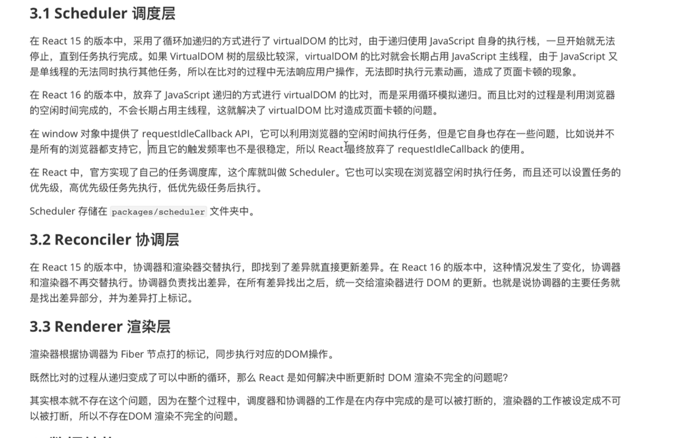
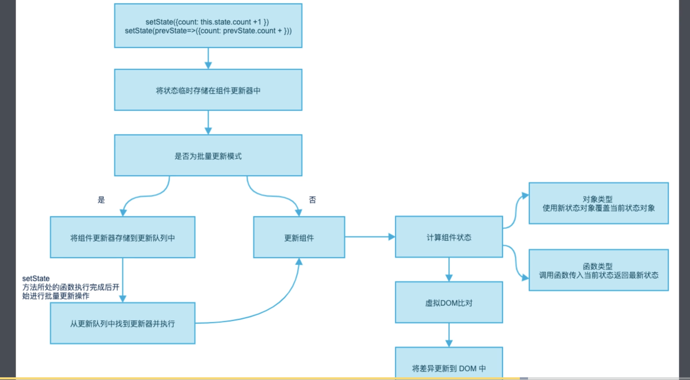

# React

MDX？了解

#### React的优势是什么？

React是一个js库,  一切皆是组件，声明式范式可以轻松描述应用，让业务逻辑与DOM操作进行很好的分离

为什么选择JSX？模板分散了技术栈和关注点，模板也引入了其他的概念(模板的语法)


## CreateElement

- jsx组件(babel转化)最后执行的是createElement的调用
- 参数(type, config, children)
- 分离普通属性和特殊属性( key \ ref \ __ self \ __ source )
- 把子元素挂在到props上
- 处理props的defaultProps
- 返回ReactElement

## VirtualDOM 和 Diff 算法

- virtualDom(babel只是把jsx转成React.createElement的调用,虚拟DOM是createElement的返回值)是真实DOM的一个副本，是描述真实DOM的js对象，包含type：html标签名，props： 元素的属性，children： 元素的子元素等

- diff：在 React 第一次创建 DOM 对象后，会为每个 DOM 对象创建其对应的 Virtual DOM 对象，在 DOM 对象发生更新之前，React 会先更新所有的 Virtual DOM 对象，然后 React 会将更新后的 Virtual DOM 和 更新前的 Virtual DOM 进行比较，从而找出发生变化的部分，React 会将发生变化的部分更新到真实的 DOM 对象中，React 仅更新必要更新的部分。

  Virtual DOM 对象的更新和比较仅发生在内存中，不会在视图中渲染任何内容，所以这一部分的性能损耗成本是微不足道的。

  - 判断virtualDOM类型是否相同，相同再判断是否是元素节点，是元素节点就判断属性是否变化，如果是文本节点则看文本节点内容发生变化；再循环未更新前的 Virtual DOM 对象，通过对比看看新的 Virtual DOM 中是否有被删除的属性，如果存在删除的属性 需要将 DOM 对象中对应的属性也删除掉
  - 为减少更新对比开销，会为同级节点增加key属性，在类型相同时，循环旧的VirtualDom的key并保存key与真实DOM，然后通过遍历新的vDom拿到key去旧的map，如果有，说明元素已经存在，不需要重新创建，
  - 当虚拟DOM类型不同时(且不是组件时)，直接使用新的virtualDOM创建DOM对象，用新的DOM替换旧的，是同一个组件则调用相应的生命周期函数并传入新的props得到新的vdom，对比
  - 继续对子节点进行递归


##  React 中初始渲染的流程

- 执行React.render( element \ container \ call?), 清除根节点下的所有子元素, 创建 ReactRoot,开始创建FiberRoot(current fiber树中的Fiber对象， `root._internalRoot`) 和 rootFiber（id为root对应的div所对应的对象），`FiberRoot.current = rootFiber;rootFiber.statNode = FiberRoot`, 然后为 fiber 对象添加 updateQueue 属性，**初始化渲染**执行unbatchedUpdates方法(为什么不是批量更新？每次想一下)调用 render 方法返回的是render第一个参数的真实 DOM 对象

- unbatchedUpdates实际执行的就是(updateContainer) enqueueUpdate 将当前更新压入队列，后执行scheduleUpdateOnFiber,构建workInProgress

  **`updateQueue.shared.pending 就是待执行的任务，首次渲染就是null，会把初始更新的任务挂在到这里`**

- workLoopSync, 循环更新，每更新一个Fiber节点就判断下是否有更高优先级的任务要执行

- 执行performUnitOfWork，beginWork（从父到子构建）,构建Fiber树，深度优先遍历，构建当前Fiber节点的子级FIber，确立子级fiber的同级fiber关系(sibling: 下一个兄弟节点,return： 父Fiber),第一个子节点是workInProggress节点的子级。当前节点有子级返回子级重复上述步骤，当workInProgress没有子节点，开始构建的向上阶段，并开始构建Fiber链表。当前workInprogress存在(while)，则执行compeleteUnitofWork构建Fiber链表(并为每个节点构建stateNode(真实DOM))，用当前Fiber的父Fiber保存firstEffect和lastEffect，当前Fiber的first和last先赋给父Fiber，有EffectTag则进行链表lastEffect.nextEffect的赋值，并把父FIber的lastEffect指向当前Fiber，执行完成后，有同级则返回同级执行performUnitOfWork，没有同级workInProgress 则指向父级，找父级的同级执行completeUnitOfWork

- 以上发生在render阶段

- 以上整个过程完成，则进行commitRoot阶段，这个阶段不能中断，遍历Fiber链表，从firstFiber开始挂载DOm
  - 第一次遍历 effects list（commitBeforeMutationEffects）：在更改前读取 DOM 上的 state，这里是 getSnapshotBeforeUpdate [生命周期](https://www.zhihu.com/search?q=生命周期&search_source=Entity&hybrid_search_source=Entity&hybrid_search_extra={"sourceType"%3A"article"%2C"sourceId"%3A103506207})（此函数只在更新阶段调用首次渲染不会执行）调用的地方；
  - 第二次遍历 effects list（commitMutationEffects）：此阶段是真正更改 DOM 的阶段；
  - 第三次遍历 effects list（commitLayoutEffects）：执行[生命周期函数](https://www.zhihu.com/search?q=生命周期函数&search_source=Entity&hybrid_search_source=Entity&hybrid_search_extra={"sourceType"%3A"article"%2C"sourceId"%3A103506207}) 和 函数组件的Effect钩子 等 componentDidMount（首次渲染）、componentDidUpdate(更新阶段).

------

## Fiber

#### 什么是Fiber?

- Fiber 是一个执行单元

  在 React 15 中，将 VirtualDOM 树整体看成一个任务进行递归处理，任务整体庞大执行耗时且不能中断。

  在 React 16 中，将整个任务拆分成了一个一个小的任务进行处理，每一个小的任务指的就是一个 Fiber 节点的构建。

  任务会在浏览器的空闲时间被执行，每个单元执行完成后，React 都会检查是否还有空余时间，如果有就交还主线程的控制权。

- Fiber 是一种数据结构

  支撑 Fiber 构建任务的运转,通过链表找到找到下一个要执行的单元，Fiber中第一个子节点是child，return表示父节点，sibling表示下一个兄弟节点

  ```tsx
    {
      type         节点类型 (元素, 文本, 组件)(具体的类型)
      props        节点属性
      stateNode    节点 DOM 对象 | 组件实例对象 | rootFiber 是整个FiberRoot数据
      tag          节点标记 (对具体类型的分类 hostRoot || hostComponent || classComponent || functionComponent)
      effects      数组, 存储需要更改的 fiber 对象
      effectTag    当前 Fiber 要被执行的操作 (新增, 删除, 修改)
      parent       当前 Fiber 的父级 Fiber
      child        当前 Fiber 的子级 Fiber
      sibling      当前 Fiber 的下一个兄弟 Fiber
      alternate    Fiber 备份 fiber 比对时使用
    }
  ```

#### Fiber工作方式？

- Fiber架构分为三层：

  - Scheduler：实现浏览器空闲时执行任务，可以设置任务的优先级

  - Reconclier：构建Fiber节点，找出 节点差异部分，并打上标记

  - Render：根据标记同步执行对应的DOM操作

    

- React分为两个阶段（[官网](https://zh-hans.reactjs.org/docs/strict-mode.html#detecting-unexpected-side-effects)）
  
  - **渲染** 阶段会确定需要进行哪些更改，比如 DOM。在此阶段，React 调用 `render`，然后将结果与上次渲染的结果进行比较。(最耗时)
  
    `提交阶段通常会很快，但渲染过程可能很慢。因此，即将推出的 concurrent 模式 (默认情况下未启用) 将渲染工作分解为多个部分，对任务进行暂停和恢复操作以避免阻塞浏览器。这意味着 React 可以在提交之前多次调用渲染阶段生命周期的方法，或者在不提交的情况下调用它们（由于出现错误或更高优先级的任务使其中断）。`
  
  - **提交** 阶段发生在当 React 应用变化时。（对于 React DOM 来说，会发生在 React 插入，更新及删除 DOM 节点的时候。）在此阶段，React 还会调用 `componentDidMount` 和 `componentDidUpdate` 之类的生命周期方法。
  
- render阶段：构建 Fiber 对象，构建链表，在链表中标记要执行的 DOM 操作 ，可中断。
  
  - 深度遍历优先，从上向下走，构建节点对应的 Fiber 对象，然后再从下向上走，构建 Fiber 对象及链表。
  
- commit：根据构建好的链表进行 DOM 操作，不可中断(分为三个子阶段)
  - 第一个子阶段：循环Fiber effect链，执行commitBeforeMutationEffects (类： getSnapshotBeforeUpdate，函数组件调用useEffect)，返回值用于componentDidUpdate的地三个参数
  - 第二个子阶段：commitMutationEffects，插入节点commitPlacement(找到父级原生DOM插入)，更新节点commitWork(updatePayload对属性进行处理，针对HostComponent和HostText处理)，删除节点commitDeletion(非原生节点需要遍历子树，调用componentWillUnmount)，循环整个Fiber链表(firstEffet => nextEffect =>  ... => nextEffect = null, firstEffect)，根据EffectTag (Placement、Update、PlacementAndUpdate等)执行上述的DOm操作
  - 第三个子阶段： 循环nextEffect，commitLayoutEffects，如果类组件或函数组件有对应的生命周期函数或钩子函数
    - 类组件： 获取组件实例，首次渲染执行componentDidMount，更新阶段就会获取旧的props和state执行componentDidUpdate，如果有任务队列执行任务队列函数
    - 函数组件：获取updateQueue，依次执行函数组件中的副作用effect

  > [参考1_知乎](https://zhuanlan.zhihu.com/p/103506207)
  
- workInProgress Fiber 树存在的意义：

  - react采用双缓存机制，来完成Fiber树的构建和替换，实现DOM的快速更新；

    其中当前显示的是currentFiber ， 需要更新时，再重新产生一个新的Fiber树，这里的Fiber就是workInProgress Fiber ，新的Fiber构建完成会进行替换，他们身上有一个alternate属性互相指向对方；

  - workInProgress 的构建过程是在内存中完成的，所以构建过程非常快，从而达到页面的快速更新
  - Fiber中每一个节点就是一个渲染任务，从而将整个页面拆分成更小的执行任务单元，从而在每次执行前可以检查是否执行其他高优先级的任务

```react
// 获取最外层container
const container = document.getElementById('root');
// 构建最外层rootFiber
const rootWorkInProgress = {
  stateNode: container,
  props: {
    children: [...] // React.CreateElement('typeName', {}, ...children)
  }
}

// 空闲时间执行Fiber对象的构建
requestIdleCallback(workLoop);


let nextUnitOfWork = rootWorkInProgress;

function workLoop (deadline) {
  // 构建Fiber，深度遍历优先
  while (nextUnitOfWork && deadline.timeRemaing() > 1) {
    nextUnitOfWork = performUnitOfWork(nextUnitOfWork);
  }

  // nextUnitOfWork 为null的时候则构建Fiber完成，进行Dom操作，即提交阶段
  if (!nextUnitOfWork) {
    commitRoot()
  }
}

function performUnitOfWork(workInProgress) {
  // 创建当前Fiber节点的DOM对象并保存在stateNode中
  // 构建子级Fiber对象
  // 构建向下阶段
  beginWork(workInProgress)
  if (workInProgress.child) {
    return workInProgress.child
  }

  // 构建向上阶段
  while (workInProgress) {
    // 构建Fiber链表
    commpleteUnitOfWork(workInProgress);

    // 有同级返回同级，没有同级则退回到父级，找父级的同级，...
    if (workInProgress.sibling) {
      return workInProgress.sibling;
    }
    workInProgress = workInProgress.return
}

function beginWork(workInProgress) {
  // 当前Fiber没有statNode则创建DOm节点
  if (!workInProgress.stateNode) {
    workInProgress.stateNode = document.createElement(workInProgress.type);
    for (let attr in workInProgressFiber.props) {
      if (attr !== 'children') {
        workInProgress.stateNode[attr] = props[attr]
      }
    }
  }
  // 构建子级Fiber
  const workInProgressChildren = workInProgress.props.children
  if (Array.isArray(workInProgressChildren)) {
    let prevFiber = null;
    workInProgressChildren.forEach((child, index) => {
      const currChildFiber = {
        type: child.type,
        props: child.props,
        effectTag: 'PLACEMENT',
        return: workInProgress, // 当前子级的父级
      }
      if (index === 0) { // 第一个子是父的子
        workInProgress.child = currChildFiber;
      } else {
        prevFiber.sibling = currChildFiber;
      }
      prevFiber = currChildFiber;
    })
  }
}

function commpleteUnitOfWork(workInProgress) {
  // 开始创建Fiber链表
  let workParentFiber = workInProgress.return;
  if (workParentFiber) {
    // 链头上移
    if (!workParentFiber.firstEffect) {
      workParentFiber.firstEffect = workInProgress.firstEffect;
    }
    // lastEffect上移
    if (!workParentFiber.lastEffect) {
      workParentFiber.lastEffect = workInProgress.lastEffect;
    }

    // 构建链表
    if (workInProgress.effectTag) {
      if (workParentFiber.lastEffect) {
        workParentFiber.lastEffect.nextEffect = workInProgress;
      } else {
        // 第一次操作，即Fiber是在最左下的节点(c1)才执行这里
        workParentFiber.firstEffect = workInProgress;
      }
      workParentFiber.lastEffect = workInProgress;
    }
  }

}

function commitRoot() {
  // Fiber的工作的第二阶段，执行真实DOM操作
  let currFiberNode = rootWorkInProgress.firstEffect;
  while (currFiberNode) {
    currFiberNode.return.stateNode.appendChild(currFiberNode.stateNode)
    currFiberNode = currFiberNode.nextEffect
  }
}
```


## 知识点

#### React Suspense

- 处理I/O密集型场景，用三元运算也可以实现，主要是会出现说waterfall的问题
  - **Suspense是要解决那些本可以并发的异步操作（包含Promise的组件），变成序列化串行（waterfall）的问题，也就是上面提到的I/O密集型问题，而不单单是组件的显示内容问题**

- 是一种在等待组件渲染前进行其他操作的同时渲染预先准备的内容的机制
- Suspense的child必须是一个promise，需要promise的状态来触发suspense
- 一般使用结合lazyload
- 自己实现的话要对子组件实现专门的wrapped处理，保证不会重复加载数据等
- 怎么实现suspense？要抛出一个错误的promise

#### React setState同步异步？

- setState会将修改内容进行保存进行一个批量更新

- 同步还是异步主要取决于它被调用的环境，即受react控制的时候比如生命周期内就是异步的(并且连续的setState的调用会进行一个状态的合并，类似于Object.assign())

- 进入了 `react` 的调度流程，那就是异步的。没有进入 `react` 的调度流程，那就是同步的。`setTimeout` `setInterval` ，直接在 `DOM` 上绑定原生事件等都不会走React的调度流程，就是同步，其他的都是异步

  `调用 `setState` 其实是异步的 —— 不要指望在调用 `setState` 之后，`this.state` 会立即映射为新的值`，这样的目的减少不必要的DOM的操作，减少频繁的render更新，因为如果每调用一次就走一次完整的生命周期流程性能开销比较大也没必要

  `事件处理函数内部的setState是异步的，如果 Parent 和 Child 在同一个 click 事件中都调用了 setState ，这样就可以确保 Child 不会被重新渲染两次`

- scheduleUpdateOnFiber： 在这个函数中executionContext === NoContext则就是要同步更新

- 如果要把同步更新的setstate变成异步的，有一个函数unstable_batchedUpdates(() => {}) ,强制批量更新

  

#### React 合成事件

- `SyntheticEvent` 实例将被传递给事件处理函数，它是浏览器的原生事件的跨浏览器包装器
- stopPropagation和preventDefault
- 优势：减少内存消耗避免频繁解绑
- React17的事件是注册到root上而非document，这主要是为了渐进升级，避免多版本的React共存的场景中事件系统发生冲突
- 在源码中，createConatiner中，有一个`listenToAllSupprtedEvents(rootContainerElement)`
  - allNativeEvent,原生事件，一开始react收集用到的所有事件名，实际上我们使用的事件最后都会冒泡到根节点，react的合成事件一开始会被注册到根节点上(除了selectchange时间就是复制选中的事件，只能被绑定在document上)


#### 事件冒泡和捕获

- 定义： 是一种机制，主要描述当在同一个元素上定义了多个同类型事件处理器被激活时怎么处理，也是解决页面事件流的问题的关键点
- 当一个事件发生在具有父元素的元素上，现代浏览器具有的两个阶段：捕获阶段和冒泡阶段
  - 为什么要用两个阶段？早起浏览器兼容性差，一些只支持事件捕获，一些只支持IE的冒泡，W3C为了整合这两者
  - 捕获阶段：浏览器检查目标元素的最外层祖先元素html，看此时是否注册了相同的事件处理程序，有则执行，接着再检查html内目标元素的下一个祖先元素，执行相同的操作，直到到达目标元素
  - 冒泡阶段：浏览器检查目标元素是否注册了该事件，是并执行，再检测目标的下一个直接祖先元素是否有同类事件，层层传递直到html元素
  - 现代浏览器默认情况下所有事件处理程序是在冒泡阶段注册，可以通过事件对象的stopPropagation来阻止冒泡
  - 冒泡还可以进行**事件委托**，当需要对大量的子组件进行事件监听执行一段代码的时候，可以将事件监听器设置在其父节点上，并让子节点上发生的事件冒泡到父节点上，而不是每个子节点单独设置事件监听器

#### useCallback 与 useMemo 区别

- useCallback：缓存的回调函数， 针对可能重新创建的函数进行优化，使得函数被缓存，React.memo 认定两次地址是相同就可以避免子组件冗余的更新。
- useMemo： 针对不必要的计算进行优化，避免了当前组件中一些的冗余计算操作
- useEffect传入[]为什么只更新一次？
  - 默认情况下，useEffect在第一次渲染之后*和*每次更新之后都会执行

#### useReducer

- 管理组件的内部复杂的state

```js
const useReducer = (reducer, initState) => {
  const [state, setSate] = useState(initState)
  function dispatch (action) {
    setState((preState) => reducer(preState, action))
  }
  return [state, dispatch]
}
```

#### refs、useRef

- **refs**：
  - ref 对象是一个 `current` 属性可变且可以容纳任意值的通用容器，类似于一个 class 的实例属性，提供一种访问DOM节点(或在render中创建的React元素)的方式，适用于：
    - 管理焦点，文本选择或媒体播放。
    - 触发强制动画。
    - 集成第三方 DOM 库。
  - 修改时机： 通常应该在**事件处理器和 effects** 中修改 refs

- **useRef**：

  - 返回一个可变的ref对象，初始 .current 就是传入的初始值

    `const refContainer = useRef(initialValue);`

  - 用于DOM ref，可以命令式的访问子组件，如`myRef.current.focus();`

  

#### 实现一个自定义hook

- 定义： 将共享的逻辑提取出来单独组成一个函数，本质是把react提供本身的hook进行组合

- ```js
  const useStep = (currStep, error) => {
    const [isActive, setActive] = useState(false);
    useEffect(() => {
      if (currStep === 'xxx' || error) {
        setActive(true)
      }
    }, [currStep, error])
    return isActive
  }
  ```

#### 高阶组件

- **高阶组件是参数为组件，返回值为新组件的函数**，复用组件逻辑的一种高级技巧， HOC 解决横切关注点
- HOC 是纯函数，没有副作用
- 不要再render方法中运用HOC，这不仅仅是性能问题 - 重新挂载组件会导致该组件及其所有子组件的状态丢失
- refs不会被传递，`ref` 实际上并不是一个 prop - 就像 `key` 一样

```js
function logProps(WrappedComponent) {
  class LogProps extends React.Component {
    componentDidUpdate(prevProps) {
      console.log('old props:', prevProps);
      console.log('new props:', this.props);
    }

    render() {
      return <WrappedComponent {...this.props} />;
    }
  }
  return LogProps;
}
// 外部传入 的ref不会被传入到WrappedComponent组件，而是会被传到LogProps

// 此函数接收一个组件...
function withSubscription(WrappedComponent, selectData) {
  // ...并返回另一个组件...
  return class extends React.Component {
    constructor(props) {
      super(props);
      this.handleChange = this.handleChange.bind(this);
      this.state = {
        data: selectData(DataSource, props)
      };
    }

    componentDidMount() {
      // ...负责订阅相关的操作...
      DataSource.addChangeListener(this.handleChange);
    }

    componentWillUnmount() {
      DataSource.removeChangeListener(this.handleChange);
    }

    handleChange() {
      this.setState({
        data: selectData(DataSource, this.props)
      });
    }

    render() {
      // ... 并使用新数据渲染被包装的组件!
      // 请注意，我们可能还会传递其他属性
      return <WrappedComponent data={this.state.data} {...this.props} />;
    }
  };
}
```

#### 组件的通信/数据传递

- 典型数据流： props 父传子

- store数据

- 传入函数，通过函数的参数子传父

- **Context**：

  - 主题或首选语言等场景

  - Context 主要应用场景在于*很多*不同层级的组件需要访问同样一些的数据(locale\theme或缓存数据)。请谨慎使用，因为这会使得组件的复用性变差。

  - 手写一个Context

    ```js
    const ThemeContext = React.createContext('light');
    const App = () => {
      return (
        <ThemeContext.Provider value={}>
          <ParentComponent />
        </ThemeContext.Provider>
      );
    }
    const ParentComponent = (props) => {
      return (
        <ThemeButtonComponent />
      )
    }
    const ThemeButtonComponent = () => {
      const theme = useContext(ThemeContext)
      return (
        <Button onClick={}>
        	{theme}
        </Button>
      )
    }
    ```

  - 实现原理：

#### React Router 的实现原理

- 为什么需要？单页应用spa页面的出现，只有一个html文件，下载所有css js文件，所有页面都在一个容器下，页面的切换本质是组件的切换，实现原理就是切换url，监听url变化，从而实现页面组件的变化

- react-router-dom、react-router、history

- history

  - history模式，通过监听popstate事件，改变路由：window.history.pushState(state,title,path)、history.replaceState

    `调用`history.pushState()`或`history.replaceState()`不会触发`popstate`事件。只有在做出浏览器动作时，才会触发该事件，如用户点击浏览器的回退按钮（或者在Javascript代码中调用`history.back()`或者`history.forward()`方法）`

  - hash模式，通过监听hashchange事件，改变路由：**window.location.hash**

  - 原理：createBrowserHistory： setState、push、handlePopState

    history.push流程：**首先生成一个最新的`location`对象，然后通过`window.history.pushState`方法改变浏览器当前路由(即当前的path),最后通过`setState`方法通知`React-Router`更新，并传递当前的location对象，由于这次url变化的，是`history.pushState`产生的，并不会触发`popState`方法，所以需要手动`setState`，触发组件更新**。

    在`hash`模式下 ，`history.push` 底层是调用了 `window.location.href`来改变路由。`history.replace`底层是掉用 `window.location.replace`改变路由。

    ```js
    const PopStateEvent = 'popstate'
    const HashChangeEvent = 'hashchange'
    /* 这里简化了createBrowserHistory，列出了几个核心api及其作用 */
    function createBrowserHistory(){
        /* 全局history  */
        const globalHistory = window.history
        /* 处理路由转换，记录了listens信息。 */
        const transitionManager = createTransitionManager()
        /* 改变location对象，通知组件更新 */
        const setState = () => { /* ... */ }
        
        /* 处理当path改变后，处理popstate变化的回调函数 */
        const handlePopState = () => { /* ... */ }
       
        /* history.push方法，改变路由，通过全局对象history.pushState改变url, 通知router触发更新，替换组件 */
        const push=() => { /*...*/ }
        
        /* 底层应用事件监听器，监听popstate事件 */
        const listen=()=>{ /*...*/ } 
        return {
           push,
           listen,
           /* .... */ 
        }
    }
    ```

  - **Router**：接受通知，派发更新流，把更新的location history传递下去，借助React.Context，RouterContext.Provider
  - **Switch** 匹配正确的唯一路由，RouterContext.Consumer，遍历每个子组件的path或者redirect的form匹配正确的组件
  - **Route** 页面承载容器，通过RouterContext.Consumer 取出上一级的`location,match`等传递给页面组建
  - **Redirect** 没匹配的路由就重定向到此路由

  [参考](https://juejin.cn/post/6886290490640039943#heading-18)

#### 受控组件、非受控组件

- 受控组件：是针对html中有自己state并根据用户输入来更新的表单元素而言(<input /> <textarea /> <select />)
- 让React组件本身的state成为唯一数据源，让渲染表单的React组件控制用户输入过程发生的操作和更新，被React以这种方式控制值的表单输入元素叫受控组件
- 非受控组件： 表单数据将交由 DOM 节点来处理，<input type="file" />始终是一个非受控组件，借助ref Dom

#### React性能优化

- React.lazy
- 合理运用shouldComponentUpdate 和pureComponent 以及React.memo
- 不要再render方法中运用HOC，这不仅仅是性能问题 - 重新挂载组件会导致该组件及其所有子组件的状态丢失

#### Virtual DOM 真的比操作原生 DOM 快吗?

- VirtualDOM最大的好处在于抽象了渲染的过程，为应用带来了跨平台的能力
- Virtual DOM为UI函数式编程打开了大门，用声明式的方式来描述目的
- 页面真正的消耗在于DOM的操作，而diff等js计算相比起来极其便宜
- VD优化了只有微小变动的时候，页面更新保证了性能，减少了不必要的DOM操作

#### Hook的实现原理

- hook用闭包来保存状态，使用链表来保存一系列的hooks，把第一个hook与fiber关联，fiber树更新的时候就可以计算出最终的输出状态和相关的副作用
- 不能在if中使用，只能在函数中使用
- memorizeState保存在fiber节点上

#### 虚拟列表实现

- 原理：在vListContainer中渲染了一个真实list高度的“幻影”容器从而允许用户进行滚动操作。其次我们监听了onScroll事件，并且在每次用户触发滚动是动态计算当前滚动Offset（被滚上去隐藏了多少）所对应的开始下标（index）是多少。当我们发现新的下边和我们当前展示的下标不同时进行赋值并且setState触发重绘。当用户当前的滚动offset未触发下标更新时，则因为本身phantom的长度关系让虚拟列表拥有和普通列表一样的滚动能力。当触发重绘时因为我们计算的是startIndex 所以用户感知不到页面的重绘（因为当前滚动的下一帧和我们重绘完的内容是一致的）

[[参考](https://slbyml.github.io/QA/virtaul.html#_2-%E5%AF%B9-react-%E7%9A%84-virtual-dom-%E7%9A%84%E8%AF%AF%E8%A7%A3%E3%80%82)]

#### render需要满足的条件

`React`创建`Fiber树`时，每个组件对应的`fiber`都是通过如下两个逻辑之一创建的：

- render。即调用`render`函数，根据返回的`JSX`创建新的`fiber`。
- bailout。即满足一定条件时，`React`判断该组件在更新前后没有发生变化，则复用该组件在上一次更新的`fiber`作为本次更新的`fiber`。
- **什么时候进入bailout逻辑？**
  - oldProps === newProps
  - Context的value没有改变
  - workInProgress.type === current.type 
  - !includesSomeLane(renderLanes, updateLanes)， 当前`fiber`上是否存在`更新`，如果存在那么`更新`的`优先级`是否和本次整棵`fiber树`调度的`优先级`一致？

#### React 中Lane优先级

- Lane：不同的赛道可以作为同一批次执行，同一个赛道中的任务有不同的优先级
- React事件优先级
- Lane优先级
- Scheduler优先级

#### Error Boundaries

- 16版本， [`componentDidCatch()`](https://zh-hans.reactjs.org/docs/react-component.html#componentdidcatch) ， static getDerivedStateFromError()，类组件中实现，只有 class 组件才可以成为错误边界组件(17.0)
- 以下错误不能捕获
  - 事件处理（[了解更多](https://zh-hans.reactjs.org/docs/error-boundaries.html#how-about-event-handlers)）
  - 异步代码（例如 `setTimeout` 或 `requestAnimationFrame` 回调函数）
  - 服务端渲染
  - 它自身抛出来的错误（并非它的子组件）

#### 设计基础组件的原则

- 通用性，单一职责
- 扁平的数据props，state跟功能相关，不能跟业务绑定
- **放弃对DOM的掌控**，只提供**最基础的DOM、交互逻辑**
- 纯组件
- 多个小功能分离

### useEffect中返回的函数执行时机

- **会在组件卸载的时候执行清除操**
- **会在执行当前 effect 之前对上一个 effect 进行清除**


1. 函数组件和类组件的区别？
2. key 的作用？key为什么最好不要用index？
