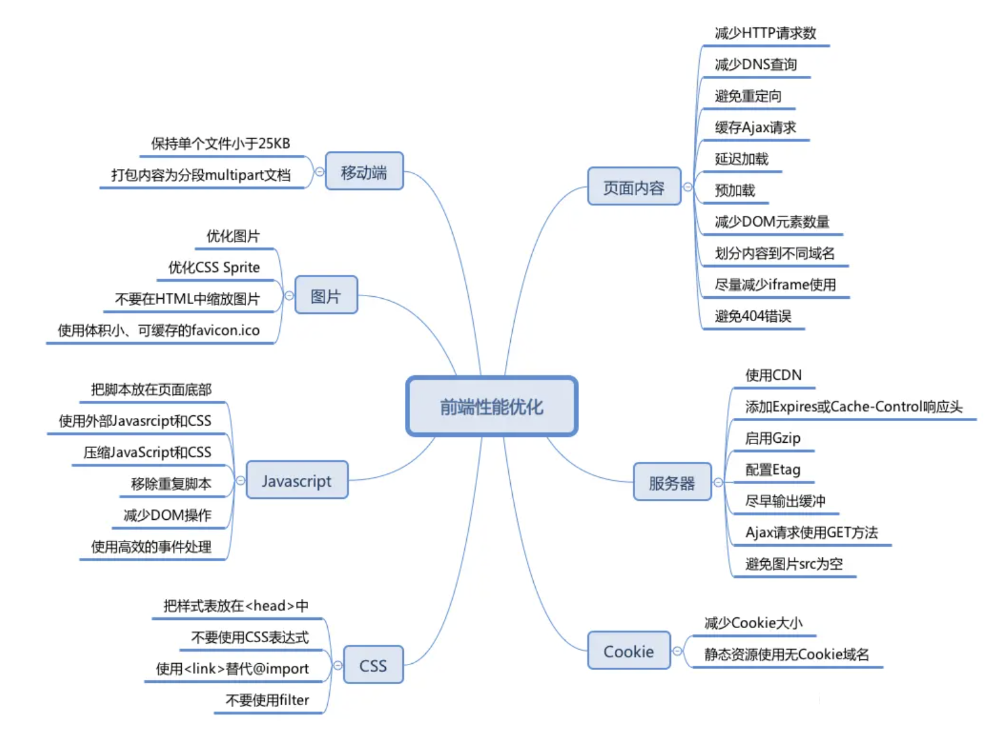

# webpack
###  原理打包？常用的插件

- 怎么提升webpack的打包速度（减少打包体积）？

  1. dll 动态库，开发环境下让大的外部依赖模块打包成dll库，这样以后不用每次再打包

  2. webpack config 可以配置prod和dev的模式，单独配置merge

  3. entry可以有多个，输出目录的配置，runtimechunk可以减少浏览器请求的一些公共文件，进行缓存

  4. Splichunks动态加载的模块进行单独打包，懒加载设置，，外部模块 .vendor

  5. 接入CDN

  6. scope hoisting
  
  7. 对于loader，用include和exclude控制需要转义的范围
  
  8. 按需加载
  
     **require.ensure(dependencies, callback, chunkName)**
  
     import
  
  9. 按需引入
  
  10. Happypack，loader变为多进程
  
  11. 用webpack-bundle-analyzer看打包后的模块分析，找出过大的模块 （减少打包体积）
  
  12. tree shaking
  
  13. webpack4之后，活用[optimization](https://webpack.docschina.org/configuration/optimization/#optimizationchunkids)配置对项目进行自定义优化，虽然它根据mode也可以是自动的
  
  6. CompressionWebpackPlugin对资源进行gzip压缩

#### 前端性能工程优化([详情](https://liuliuliu.yuque.com/staff-ihrmb9/ot84gf/sgeu7q#WfnNu))



- 图片优化，选择适合的图片格式
  - Base64、webP
- 资源构建传输优化
  - webpack相关的优化(见上述wepack性能优化)
  - http2
  - gzip
- CDN
- 请求缓存优化
- 本地缓存优化
- 浏览器渲染在开发中可优化的点
- 借助perfermance
- 通用优化技术
  - 懒加载预加载
  - 防抖节流虚拟列表
  - SSR

#### 什么是CDN？简述其原理，什么时候更新？

- 由分布在不同区域边缘节点服务器群组成的分布式网路

- 目的给多种场景的内容加速，例如：图片小文件、大文件下载、视音频点播、直播流媒体、全站加速、安全加速；同时也减少带宽成本

- **CDN的优势很明显：**

  （1）[CDN节点](https://www.zhihu.com/search?q=CDN节点&search_source=Entity&hybrid_search_source=Entity&hybrid_search_extra={"sourceType"%3A"article"%2C"sourceId"%3A"34464685"})解决了跨运营商和跨地域访问的问题，访问延时大大降低；

  （2）大部分请求在CDN边缘节点完成，CDN起到了分流作用，减轻了源站的负载。

- CDN缓存什么时候更新

  - CDN边缘节点缓存策略因服务商不同而不同，但一般都会遵循http标准协议，通过http响应头中的Cache-control: max-age的字段来设置CDN边缘节点数据缓存时间
  - CDN缓存刷新，开发者可以通过CDN服务商提供的“刷新缓存”接口来达到清理CDN边缘节点缓存的目的
  - （1）改图保持图片URL不变，可以避免[商品链路](https://www.zhihu.com/search?q=商品链路&search_source=Entity&hybrid_search_source=Entity&hybrid_search_extra={"sourceType"%3A"answer"%2C"sourceId"%3A1604554133})的缓存失效。
    （2）在访问高峰到来之前v，提前预热图片到CDN，可以避免CDN缓存失效对源站的压力

- 工作原理：
  - 当终端用户（北京）向`www.a.com`下的指定资源发起请求时，首先向LDNS（本地DNS）发起域名解析请求。LDNS检查缓存中是否有`www.a.com`的IP地址记录。如果有，则直接返回给终端用户；如果没有，则向授权DNS查询。
  - 当授权DNS解析`www.a.com`时，返回域名CNAME `www.a.tbcdn.com`对应IP地址。
  - 域名解析请求发送至阿里云DNS调度系统，并为请求分配最佳节点IP地址。
  - LDNS获取DNS返回的解析IP地址。
  - 用户获取解析IP地址。
  - 用户向获取的IP地址发起对该资源的访问请求。
  - CDN的加速资源是跟域名绑定的。 通过域名访问资源，首先是通过DNS分查找离用户最近的CDN节点（边缘服务器）的IP
    通过IP访问实际资源时，如果CDN上并没有缓存资源，则会到源站请求资源，并缓存到[CDN节点](https://www.zhihu.com/search?q=CDN节点&search_source=Entity&hybrid_search_source=Entity&hybrid_search_extra={"sourceType"%3A"answer"%2C"sourceId"%3A1604554133})上，这样，用户下一次访问时，该CDN节点就会有对应资源的缓存了。负载均衡可在多个服务器之间平均分配网络流量，从而更容易适应流量的快速增长


#### Webpack 的构建流程主要有哪些环节？描述 Webpack 打包的整个过程。

- 初始化配置参数,merge webpack.config.js或shell中输入的配置选项
- 编译
  - 创建一个`Compiler` 对象(具有文件读写能力)，该对象掌控者`webpack`声明周期，不执行具体的任务，只是进行一些调度工作
   - 挂载配置的pulgins和webpack默认的插件到此对象上
   - `Compiler` 对象需要定义某些特定事件流的钩子(对象继承自 `Tapable`)，当执行到该事件时触发回调注入一些新的操作或修改
   - `Compiler` 必须有run方法(最终调用此方法来执行打包操作)，在此方法中，实际又实例化了`Compilation`(Complier)
- `Compilation`
  - 确定entry入口(mouduleId),保存在`Compilation`属性上
   - _addModuleChain : 创建模块，存入依赖的所有模块，从文件中读取依赖模块，若不是js模块或其他非CommonJs规范的加载模块方式，则用`Loader` 进行处理，返回js模块
   - `Loader` 对一个模块转换完后，使用 `acorn` 解析转换后的内容，输出对应的抽象语法树（`AST`），以方便 `Webpack`后面对代码的分析; 用自定义的_webpack_require替换模块导入的关键字require，最终将修改后的AST转换成node code保存
   - 如果依赖的模块又依赖了模块，则递归进行上述操作直到处理完所有依赖模块
- 生成chunk
  - 根据入口找到依赖所有模块后，把所有模块的源码合并到一起，并根据提供的template与源码生成chunk.js文件
  - 最后输出chunk assets到目标目录

### Loader 与plugins , 常用 loader 和 plugins

```js
// webpack.config.js
module.exports = {
  entry: './src/index.js',
  output: {
    filename: 'main.js',
    path: path.resolve(__dirname, 'dist')
  },
  module: {
    rules: [
      {
        test: /\.css$/,
        use: ['style-loader', 'css-loader', { loader: 'postcss-loader', options: { postcssOptions : {plugins: [require('autoprefixer')]}}}]  // 从右向左依次执行loader
      },
      {
        test: /\.less$/,
        use: ['style-loader', 'css-loader', 'less-loader']
      }
    ]
  }
}
```


**Loader** :  只是对文件输入到输出的转换，其本质是一个函数，这个函数如果是在最后一步执行的，其导出必须是一段js代码的字符串(在webpack中经过loader处理完后，会直接把返回值附加到输出的模块代码中)，如果返回的是其他格式，也可以用其他格式的loader再接着进行处理，所以所有loader可以配合一起使用（管道）

#### **webpack为什么需要loader？loader做了什么？**

- 如果没有loader，默认情况下webpack不会正确处理 .css等文件类型，打包会报出 `Module parse failed`

- loader本身也是一个模块，导出一个函数，对不识别的文件做一些转化

- `import 'css-loader!../css/login.css'`行内形式用loader转化

- **css-loader：**只是让webpack识别css语法，但不能把处理后的样式放在页面上使用

- **style-loader**: 会在页面上生存一个style标签，包含css中的样式

- **less-loader**：less-loader把 styles.less 转成 styles.css

- bromserslistrc，筛选出要兼容的平台，浏览器兼容性(一些语法剪头函数)，(can i use 网站查询)，可以在package文件+“browserslist”：[]选项，也可以单独设置一个browserslistrc文件

- **post-css**：是一个独立的工具，是js转换样式做兼容性处理的工具(但实际上它本身啥也不能做，需要一些插件来辅助达到目的，比如autofixer添加前缀等)，转成能兼容支持版本平台识别的样式，加前缀等(autoprefixer.github.io)，**postcss-loader需要在css-loader之前对css进行操作**

- **posts-preset-env**: 用于post-css处理一些常用插件的集合

- **file-loader**: 处理图片

- **url-loader**：也是处理图片

  `url-loader base64 uri 文件当中，减少请求次数`

  `file-loader 将资源拷贝至指定的目录，分开请求`

   `url-loader 内部其实也可以调用 file-loader，在 options中启用limit：25 * 1024`

  ```js
  {
      test: /\.(png|svg|gif|jpe?g)$/,
      use: [
        {
          loader: 'file-loader',
          options: {
            name: 'img/[name].[hash:6].[ext]',
            // outputPath: 'img'
          }
        }
      ]
    }
  /**
   * [ext]: 扩展名
   * [name]: 文件名
   * [hash]: 文件内容
   * [contentHash]:
   * [hash:<length>]
   * [path]:
   */
  ```

- **asset**： webpack5后内置了处理静态资源的模块

  ```js
  /**
   * asset module type
   * 01 asset/resource -->file-loader( 输出路径 )
   * 02 asset/inline --->url-loader（所有 data uri）
   * 03 asset/source --->raw-loader
   * 04 asset （parser ）
   */
  {
    test: /\.(png|svg|gif|jpe?g)$/,
    type: 'asset',
    generator: {
      filename: "img/[name].[hash:4][ext]"
    },
    parser: {
      dataUrlCondition: {
        maxSize: 30 * 1024
      }
    }
  },
  {
    test: /\.(ttf|woff2?)$/,  // 打包字体
    type: 'asset/resource',
    generator: {
      filename: 'font/[name].[hash:3][ext]'
    }
  }
  
  ```

- babel-loader： 处理js的兼容性

  ```js
  {
    test: /\.js$/,
    use: [
      {
        loader: 'babel-loader',
        options: {
          presets: ['@babel/preset-env']
        }
      }
    ]
  }
  ```

  

**Plugins**:  是一个函数或者包含apply方法的对象，注入到webpack中后会被webpack调用)通过注入到webpack暴露出的钩子节点进行挂载任务然后对代码的一些处理

- `loader： 转换  特定类型，工作时机就是当要去识别或读取文件内容的时候就开始工作`, loader 运行在打包文件之前
- `plugin:  更多事情 （  压缩 拆分等），webpack打包过程中也存在自己的生命周期，插件可以在整个流水线上的任意时机插入进来`

```js
// BundleAnalyzerPlugin
// 
moudule: {},
plugins: [
    new CleanWebpackPlugin()， // 清除webpack打包目录
  	new HtmlWebpackPlugin({  // 生成自动引入打包后的index.html文件
      title: 'html-webpack-plugin',
      template: './public/index.html'
    }),
    new DefinePlugin({  // 定义一些其他插件能获取到的常量，这是webpack自带的
      BASE_URL: '"./"'
    })，
    new CopyWebpackPlugin({  // copy一些不需要处理的文件
      patterns: [
        {
          from: 'public',
          globOptions: {
            ignore: ['**/index.html']
          }
        }
      ]
    })
  ]
```

```js
// 自定义插件
class MyPlugin {
    // Webpack 会调用 MyPlugin 实例的 apply 方法给插件实例传入 compiler 对象
  apply (compiler) {
    // 找到合适的事件钩子，实现自己的插件功能
    compiler.hooks.emit.tap('MyPlugin', compilation => {
        // compilation: 当前打包构建流程的上下文
        console.log(compilation);
        
        // do something...
    })
  }
}
```


### HMR热加载的原理？

- webpack express websocket，express 启动本地服务，当浏览器访问资源时以此响应；服务端与客户端用websocket实现长链接；webpack监听源代码是否有变化，当有变化时增量编译构建产生已改动模块json文件和改动模块代码js文件
- 构建完成通过hook.done发送通知，浏览器获取最新的hash，hmr runtime检查是否更新，有更新则下载manifest(改动模块的信息)，再通过模块改动信息用jsonp获取模块改动代码，更新改动模块，更改资源
- **注意点**： 两端都有hmr运行时（runtime）,hmr是增量更新、通过ws通信

#### webSocket通信原理

- Web sock: 协议、全双工，持久化，解决http协议中不适合实时通讯的特性，建立的这个过程是基于TCP三次握手后
  - 建立在TCP协议之上
  - 与HTTP协议有较好的兼容性。默认端口是80和443，并且握手阶段是采用http协议，因此握手
  - 数据开销轻量
  - 可以发送文本，也可以发送二进制数据
  - 没有同源限制
- 轮训：
- 长轮训： 多少时间内不断开，服务器资源占用比较大
- 流化技术

#### webpack的chunk和module的差别？

# Babel

### babel的使用原理，为什么需要babel？

-  jsx ts ES6+ 语法不能直接被浏览器识别，则需要转化，babel就用来转化上述的语法，处理JS兼容的问题，相当于post-css

- **@babel/core** ：babel的核心功能，本身不能对代码做一些修改，需要babel-preset-env：一些常用插件的集合(处理箭头函数 const 扩展等语法)

- @babel/cli：终端命令行的工具，依赖@babel/core

- **@babel/preset-env**：一个包含的插件支持最新的js语法的预设

  - 一个智能的preset，允许使用最新的JavaScript，而不再需要微管理你的目标环境需要哪些语法转换(以及可选的polyfill文件)。减轻了配置负担，也让打包更优化

  - **targets**："> 0.25%, not dead" or { "chrome": "58", "ie": "11"};

  - **modules**: 把esm转化成另一种模块类型，默认auto ，"amd" | "umd" | "systemjs" | "commonjs" | "cjs" | "auto" | false

  - include/exclude: [],一定要带/不要带的插件数组

  - **corejs**： 需要使用那个corejs作为polyfill，只有在useBuiltIns为usage或entry且注入的polyfills是core-js支持的，才生效，推荐3

  - **useBuiltIns**： "usage" | "entry" | false, 默认false

    - entry不会根据我们实际用到的API进行针对性引入polyfill，usage可以
    - entry需要入口处手动引入polyfill，usage不需要

  - ```js
    // babel.config.js
    // presetA presetB preset-env 逆序执行
    module.exports = {
      presets: [
        'presetA',
        ['presetB']
        [
          '@babel/preset-env',
          {
            // false: 不对当前的JS处理做 polyfill 的填充
            // usage: 依据用户源代码当中所使用到的新语法进行填充
            // entry: 依据我们当前筛选出来的浏览器决定填充什么
            useBuiltIns: 'usage',
            corejs: 3,
            "target":"iOS > 8, Android > 4", //配置目标运行环境
            "spec":false //这个option会传递到preset内部的plugin，如果plugin支持这个option, spec就会传给它。启用更加符合ES规格的代码转换，默认也是false，转换后的代码，会增加很多helper函数，代码量更大，但是代码质量更好
            "loose": true, //这个option会传递到preset内部的plugin，如果plugin支持这个option, loose就会传给它。启用松散式的代码转换，假如某个插件支持这个option，转换后的代码，会更加简单，代码量更少，但是不会严格遵循ES的规格
            "modules": false //是否启用将ES6的模块转换其它规范的模块
            "debug":true //用于开启转码的调试
          }
        ]
      ]
    }
    ```

    

- **polyfill:**  垫片，处理一些内置的不识别的语法，如：数组的新方法flat()等

  -  @babel/polyfill（拆成两个部分core-js/stable 、regenerator-runtime）,@babel/polyfill需要在源码运行前运行

    `从 Babel 7.4.0 版本开始，@babel/polyfill已经不建议使用了，建议直接包含 core-js/stable （用于模拟 ECMAScript 的功能）和 regenerator-runtime/runtime 需要使用转译后的生成器函数）`

- **@babel/plugin-transform-runtime 和 @babel/runtime** 系列：与polyfill一样，但是不会污染全局作用域

  - @babel/runtime 作为生产依赖，提供runtime能力。在`transform-runtime`作用的过程中，都会使用`@babel/runtime`内部的模块，来代替以下讲到的重复的helper函数、对全局空间有污染的相关变量。

  - @babel/plugin-transform-runtime 一个开发环境的dependency，帮助Babel注入运行时，以减少代码的插件。在开发阶段使用，打包用

    babel在转码过程中，会加入很多babel自己的helper函数，这些helper函数，在每个文件里可能都会重复在，`transform-runtime`插件可以把这些重复的helper函数，转换成公共的、单独的依赖引入，从而节省转码后的文件大小；

- **@babel/register**：通过require钩子使用babel，在node环境中，babel提供了babel-register，实现ES6的文件被node加载时自动转换为ES5的代码

**Babel的作用**

- 语法转换
- 通过 Polyfill 方式在目标环境中添加缺失的特性（core-js）
- 源码转换

- - jsx（@babel/preset-react）
  - ts（@babel/preset-typescript）

- 

### babel转化的过程？https://astexplorer.net/

- 读取配置参数config

- **解析**： 进行词法和语法分析，parser解析，得到AST抽象语法树

  原始代码字符串通过词法分析器（Tokenizer）转换为词法单元数组Tokens（可以视作是一些语法片段组成的数组），每个 Token 中包含了语法片段、位置信息、以及一些类型信息. 这些信息有助于后续的语法分析。然后再通过 语法分析器（Parser）将词法单元数组转换为抽象语法树（Abstract Syntax Tree 简称 AST），并返回

  `词法分析器 => 语法分析器 => AST抽象语法树`

  `Program`、`CallExpression`、`Identifier` 这些都是节点的类型

- **转换**：对AST进行转化

  进入转换阶段（Transformation），将上一步生成的 AST 对象 导入转换器（Transformer），通过转换器中的遍历器（Traverser），在这个过程中对节点进行增删查改，将代码转换为我们所需的新的 AST 对象；**Babel 所有插件都是在这个阶段工作, 比如语法转换、代码压缩**

  Babel 对于 AST 的遍历是深度优先遍历，对于 AST 上的每一个分支 Babel 都会先向下遍历走到尽头，然后再向上遍历退出刚遍历过的节点，然后寻找下一个分支

  **访问者模式**：

  - 进行统一的遍历操作
  - 提供节点的操作方法
  - 响应式维护节点之间的关系；

- **生成**：生成代码

  进入代码生成阶段（Code Generation），将上一步返回的新 AST 对象通过代码生成器（CodeGenerator），转换成字符串的 JavaScript Code，同时这个阶段还会生成Source Map；来帮助使用者在编译结果和编译前源码之间建立映射关系，方便调试；

### Babel中插件的顺序？

- 插件在 Presets 前运行。
- 插件顺序从前往后排列。
- Preset 顺序是颠倒的（从后往前）

### 自定义Babel插件

- 插件是一个函数，接受babel作为参数，返回一个对象，对象中包含一个visitor

  - types: 它是由 babel-types 包提供的一个工具对象, 用于构造、验证以及变换 AST 节点
  - Identifier 等方法名：声明了插件作用的 AST 节点类型，入参是 path 和 state，每个 visitor 可以包含多个这样的方法，每个方法的方法名称都是一种或多种的节点类型
  - path：path 对象代表了当前节点的路径，通过 path 节点可以访获得当前的 node 对象，以及和该路径相关的对象，比如父节点、兄弟节点等。path 对象上还包含一些操作路径的方法等。
  - state：表示代码和插件的状态，一般通过该对象访问插件的配置项。~~访问path特有的一些方法操作某一部分而不是全局的~~

  ```js
  // 自定义插件
  export default function({ types: t }) {
    return {
      visitor: {
        Identifier(path, state) {},
        ASTNodeTypeHere(path, state) {}
      }
    };
  };
  // removeConsole.js 删除console.log的babel插件
  module.exports = function ({types: t}) {
    return {
      visitor: {
        MemberExpression (path, state) {
          console.log('path===>', path)
          if (path.node.object.name === 'console' && path.node.property.name === 'log') {
            path.getStatementParent().remove()
          }
        }
      }
    }
  }
  // 在babel.config.js中增加 plugins：['./removeConsole.js']
  
  // 也可以这么写
  const MyVisitor = {
    Identifier: {
      enter() {
        console.log("Entered!");
      },
      exit() {
        console.log("Exited!");
      }
    }
  };
  ```
  


# gulp

1. 怎么打包

   自动化构建工具

# Rollup